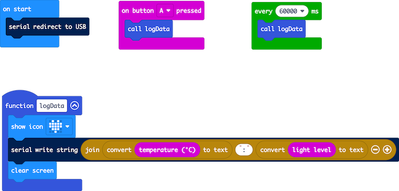
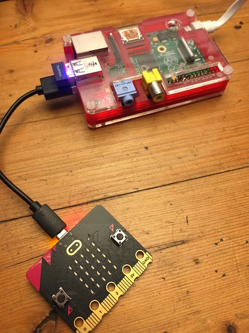
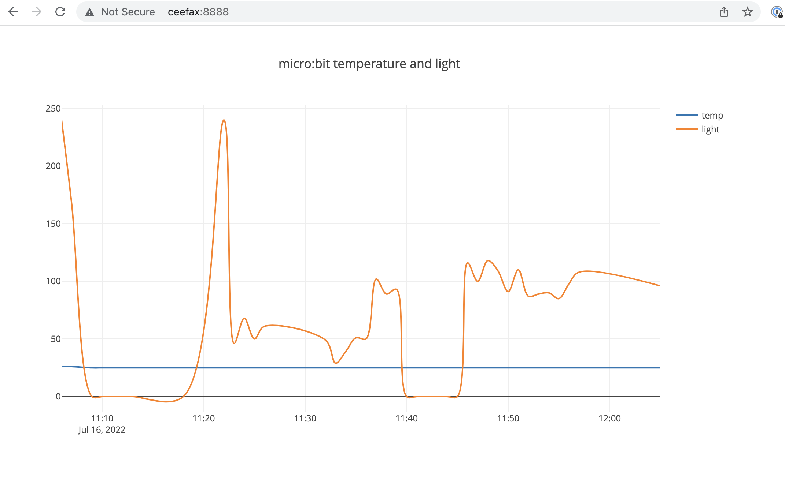

# microbit-pi-data
Log [BBC micro:bit](https://microbit.org/) sensor data in a CSV file on a Raspberry Pi and serve it as a graph in a webpage on a local network

## What you need

- A BBC micro:bit
- Any old Raspberry Pi with network connectivity, Wi-Fi or ethernet. (I used an old model B with a 'lite' version of the Raspberry Pi OS that has no GUI.)
- A micro USB cable to connect the micro:bit to the Pi
- Er, that's it


## How to make it work



Flash the HEX file above onto the BBC micro:bit. If you want to edit the program, you can drag and drop the HEX file on to the [MakeCode editor](https://makecode.microbit.org/#editor) or paste in the text in the .ts (TypeScript) version of the file, also included in this repo.
Every minute, or when you press button A, this program writes a string to the USB serial port comprising two numbers, the temperature and the light level reading separated by a colon. That's all it does. The block redirecting serial to USB probably isn't needed but is there for clarity.

Plug the micro:bit into the Raspberry Pi's USB socket.



On the Raspberry Pi, add the test.csv file and in the same folder add serial_read.py.

Add the index.html file to the same folder. 

Run the Python program by typing `python3 serial_read.py` at a terminal console prompt. If you get an error saying the port is busy, reboot the Pi and try again. If you get an unpacking error, just type `python3 serial_read.py` again. You should see data printed in the serial console every minute, or when you press button A.

This program checks once a second for serial data incoming on the serial port. It splits the incoming string into two bits of data, temperature and light level, and writes it with a timestamp to the test.csv file. The timestamp is truncated just to show the date, hours and minutes.

Now to make the data appear in a webpage on your local network, for example the wi-fi network in your house, open another terminal window on the Pi. (I connect remotely using SSH from a laptop, which I recommend as you'll need two consoles open). You'll need to know the IP address or network device name of the Pi for the next step - my Pi is called 'ceefax' but I could just as easily have used its local IP address (something like 192.168.0.23). You can find the IP address by looking on your wi-fi router's control panel or by typing `ifconfig` and looking on the second line.

Now to start a simple webserver in Python, navigate to the directory where your files are saved and type `python3 -m http.server 8888` at the terminal prompt. (You can use port numbers other than 8888).

Then, on a computer on the same network, open a browser and navigate to http://ceefax:8888/ where 'ceefax' is the network name or IP address of your Pi, and 8888 is the port number you chose. And you should see your data in a lovely interactive graph. The HTML page uses plotly.js so you can isolate individual lines by clicking on the legend, zoom in and out, all sorts!

You can play with a sample graph produced by this code here: http://suppertime.co.uk/microbit/data/ 
I changed the line type for the internal temperature from 'spline' to 'linear' here as the readings from the internal temperature sensor are only in whole numbers. I also added a button to download the raw CSV file.



## Improvements

You can customise this to log any data you like. The micro:bit has built-in sensors for acceleration and magnetism in 3 dimensions as well as light, temperature and, on the V2 model, sound. You could use the micro:bit connnected to the Pi to receive sensor data by radio from micro:bits in other room or outdoors. 

An obvious improvement is to make the Python script and webserver run automatically at start up, rather than manually in console windows on my laptop, but this is a good start and proof of concept I think. (See below).

I might also see if I can send the CSV file to my real webserver by FTP, and then serve up a data page on the actual interwebs.

## Automatic for the people

Ok, an awful lot of problems on the way, but I got it working automatically on start up.

I added these lines to /etc/rc.local:

```
sleep 10
sudo python3 /home/pi/data-logging/serial_read.py &
sudo python3 -m http.server 8888 &
```

I also edited line 25 in serial_read.py to use an absolute path to the CSV file:

`        with open('/home/pi/data-logging/test.csv', 'a', newline='') as f_object:`

Because the Python webserver is now running at root from startup, it's serving up the whole filesystem rather than just the folder where the HTML file and data are, so the graph can now be found on my set-up at http://ceefax:8888/home/pi/data-logging/

Sometimes the web page appears but the data doesn't update becuase the micro:bit doesn't appear on /dev/ttyACM0, in which case I replug the USB and reboot the Pi.

## Adding an external DS18B20 temperature sensor

The micro:bit's internal temperature sensor, in the CPU, is actually much more accurate than I imagined. I did a test comparing its readings overnight with an external sensor. I found that, over many hours, on average there was no difference at all between their readings. You can examine my data here: http://suppertime.co.uk/microbit/data/int-ext-MY_DATA.HTM

However, the internal sensor only gives readings in whole degrees C, and you may want something with more granularity. And, unlike the DS18B20, you can't put a micro:bit in a cup of tea.

You can use the DS18B20 sensor with a BBC micro:bit in the MakeCode block editor using Bill Siever's [extension](https://github.com/bsiever/microbit-dstemp). Go to Extensions and search for 'DS Temp'. Here's a link to a complete MakeCode project that sends internal and external temperature data down USB serial every 10 minutes: https://makecode.microbit.org/_6iy8og3FXEef

To connect the DS18B20 temperature sensor to a micro:bit, connect micro:bit GND pin to GND (black wire), micro:bit 3v to Vdd (red) and a GPIO pin like micro:bit pin 0 to the data wire (yellow on my sensor, but may be white). Also connect a 4.7k Ohm resistor between 3v and the data wire.

If it doesn't work, check your wiring. And check you have a real DS18B20 not a fake one. There are a lot of fakes out there, and they don't work well.

## micro:bit data logging

The BBC micro:bit V2 has its own excellent non-volatile data logging feature, which is how I gathered this data: http://suppertime.co.uk/microbit/data/int-ext-MY_DATA.HTM

Find out more about it here: https://microbit.org/get-started/user-guide/data-logging/

## Moving pictures

You can see a video about this project here: [https://youtu.be/xHIDSPagEh4](https://youtu.be/xHIDSPagEh4)
